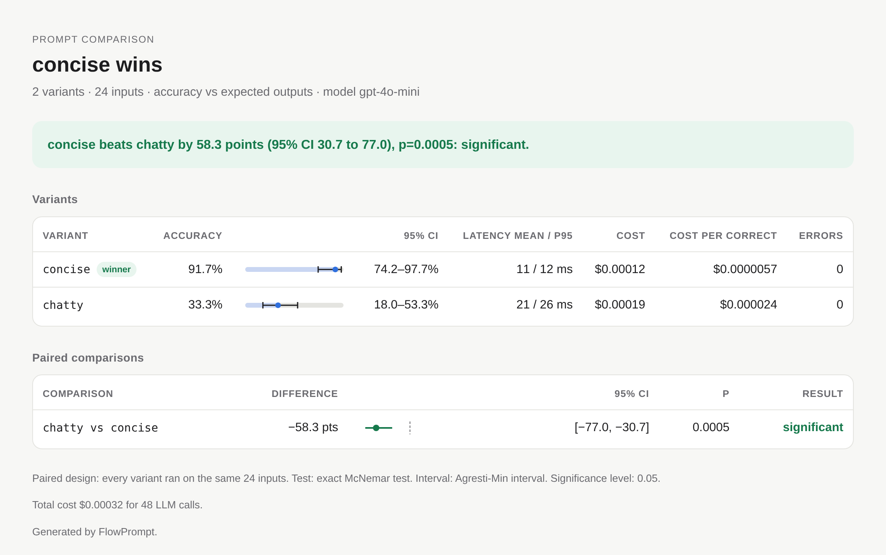

# A/B Testing Guide

FlowPrompt gives you two ways to compare prompts:

- **`compare()`** runs every variant on the same evaluation set and tells
  you, with a paired significance test, which one is better. Use it during
  development and in CI.
- **`ABTestRunner`** splits live traffic between variants, with sticky
  assignment and bandit allocation. Use it in production.

## Compare variants on an evaluation set

```python
from flowprompt import Prompt, compare


class Baseline(Prompt):
    system = "Classify the sentiment."
    user = "{text}"


class OneWord(Prompt):
    system = (
        "Classify the sentiment. Reply with one word: positive, negative or neutral."
    )
    user = "{text}"


class FewShot(Prompt):
    system = (
        "Classify the sentiment as positive, negative or neutral. One word.\n"
        "'I love it' -> positive\n'It broke' -> negative\n'It is blue' -> neutral"
    )
    user = "{text}"


result = compare(
    {"baseline": Baseline, "one_word": OneWord, "few_shot": FewShot},
    inputs=[{"text": t} for t in texts],
    expected=labels,
    eval_metric="exact",
    model="gpt-4o-mini",
)
print(result)
```

Example output (60 labelled inputs, answered offline by a simulated model;
your numbers will differ):

```text
Comparison Results
========================================================================
3 variants | 60 inputs | accuracy vs expected outputs | model gpt-4o-mini

  Variant             Accuracy      95% CI  Latency mean/p95      Cost  Cost/correct  Errors
  ------------------  --------  ----------  ----------------  --------  ------------  ------
  baseline (control)     73.3%  61.0-82.9%          0 / 0 ms  $0.00013    $0.0000030       0
  one_word               88.3%  77.8-94.2%          0 / 0 ms  $0.00025    $0.0000046       0
  few_shot * winner      90.0%  79.9-95.3%          0 / 0 ms  $0.00038    $0.0000070       0

Paired comparisons vs baseline
  Comparison            Difference         95% CI       p  Holm p  Result
  --------------------  ----------  -------------  ------  ------  -----------
  one_word vs baseline   +15.0 pts  [+5.2, +23.8]  0.0039  0.0039  significant
  few_shot vs baseline   +16.7 pts  [+6.4, +25.8]  0.0020  0.0039  significant

Verdict: few_shot beats baseline by 16.7 points (95% CI 6.4 to 25.8), adjusted p=0.0039: significant.
Method: Paired design: every variant ran on the same 60 inputs. Test: exact McNemar test. Interval: Agresti-Min interval. Multiple comparisons: Holm-adjusted over 2 comparisons. Significance level: 0.05.
Cost: $0.00076 total for 180 LLM calls.

Notes:
  - one_word also beat baseline significantly; few_shot has the largest difference, but it was not tested against it directly. Use comparisons='all' to test every pair.
```

The first variant is the **control**; every other variant is compared with
it (pass `control="name"` to choose another, or `comparisons="all"` to test
every pair). The verdict follows the Holm-adjusted p-values, and the notes
say what was and was not tested.

### What a variant can be

A variant is anything that turns an input dict into an output. Prompt
classes are the common case; the engine itself only needs a callable.

```python
from flowprompt.testing import PromptVariant, model_variants

compare(
    {
        "baseline": ExtractUser,  # Prompt class, compare()'s model
        "mini": (ExtractUser, "gpt-4o-mini"),  # same prompt, another model
        "tuned": PromptVariant(ExtractUser, model="gpt-4o", temperature=0.2),
        "rules": lambda inp: my_regex_extractor(inp["text"]),  # any callable
        "pipeline": my_async_rag_pipeline,  # async callables work too
    },
    inputs=inputs,
    expected=expected,
)

# Same prompt on several models:
compare(
    model_variants(ExtractUser, ["gpt-4o-mini", "gpt-4o"]),
    inputs=inputs,
    expected=expected,
)
```

LLM calls made through FlowPrompt inside a variant, including inside your
own callables, are metered, so cost and cost per correct answer work for
pipelines too.

### Grading outputs (scorers)

With `expected=[...]`, each output is graded by `eval_metric`:

| `eval_metric` | Passes when |
|---|---|
| `"contains"` (default) | the expected text appears in the output (case-insensitive) |
| `"exact"` | output equals expected after trimming, case-insensitive; a pydantic output matches a dict |
| `"regex"` | the expected value is a pattern found in the output |
| `"numeric"` | the last number in the output is within tolerance of the expected number |
| `"similarity"` | difflib similarity ratio is at least 0.7 |
| any callable | `fn(output, expected)` returns `True`, or a score in [0, 1] |

Factories take options, for example `scorers.numeric(abs_tol=0.01)` or
`scorers.regex(full_match=True)`:

```python
from flowprompt.testing import scorers

compare(variants, inputs, expected=totals, eval_metric=scorers.numeric(rel_tol=0.01))
```

Without `expected`, pass `success_fn=lambda output: ...` (pass/fail) or
`metric_fn=lambda output: ...` (a numeric score). With none of these the
outputs are not graded: the comparison only measures how often each
variant completed without an error, and the report says so.

Errors raised by a variant are counted per variant and scored as failures.
A scorer that raises is treated the same way instead of stopping the run.

### Repeated runs

`runs_per_input=5` runs every input five times per variant. This measures
run-to-run variation at `temperature > 0`, but it does **not** increase the
sample size: the runs are averaged per input and the test uses the number
of inputs. (Counting repeats as independent samples is the most common way
prompt A/B tests go wrong; see [the article](false-winners.md).)

If you enabled the response cache, repeated identical requests are served
from it; disable it for runs that are meant to sample.

### Reading the result

| Field | Meaning |
|---|---|
| `result.winner` | variant significantly better than the others (after Holm), or `None` |
| `result.verdict` | one plain-English sentence |
| `result.statistical_result` | the comparison that decides the outcome |
| `result.comparisons` | every comparison: `difference`, `ci_low`, `ci_high`, `p_value`, `adjusted_p`, `method`, `n_inputs`, `relative_lift` |
| `result.variants[name]` | `mean_score`, `ci_low`/`ci_high`, `mean_latency_ms`, `p95_latency_ms`, `total_cost_usd`, `cost_per_correct`, `total_tokens`, `errors` |
| `result.enough_data` | `False` when no difference could be significant with this many inputs |
| `result.notes` | caveats: ungraded outputs, errors, repeats, untested pairs |

`effect_size` equals `difference` (treatment minus control, in absolute
terms: 0.12 is 12 accuracy points). `relative_lift` is `None` when the
control scores 0.

### Reports

The same result renders as text, Markdown or a self-contained HTML page:

```python
result.save_report("ab.html")  # light/dark, no external assets
result.save_report("ab.md")  # for pull requests and job summaries
result.save_report("ab.json")  # machine-readable
markdown = result.to_markdown()
```



### How many inputs do you need?

```python
from flowprompt import plan_sample_size

plan = plan_sample_size(0.10, discordance=0.2)  # detect 10 points
print(plan)
# To detect a 10-point difference at 80% power you need ~155 inputs (~310 calls)
```

The discordance (the share of inputs on which the two variants disagree)
matters as much as the difference: prompts that fail on the same hard
inputs disagree rarely and need fewer inputs. Estimate it with a small
pilot: `result.sample_size_plan(0.10)` reuses the discordance and cost per
call observed in a previous `compare()`, and the text report prints this
line automatically when there is no winner. Pass `cost_per_call=` or
`model=` with token counts to get a cost estimate.

### Early stopping without inflating false positives

Checking a fixed-sample p-value after every batch and stopping at the first
`p < 0.05` raises the false-positive rate well above 5%. If you want to
stop early, use a test built for continuous monitoring:

```python
from flowprompt.testing import SequentialMcNemar

test = SequentialMcNemar(alpha=0.05)
for control_ok, treatment_ok in graded_pairs():  # one pair per input, in order
    if test.update(control_ok, treatment_ok):
        print(f"Stop: treatment differs after {test.n} inputs, p={test.p_value:.4f}")
        break
```

Its p-value stays valid however often you look (a Beta-mixture likelihood
ratio martingale with Ville's inequality; see
[Statistical methods](statistics.md#sequential-testing)). The price is power:
for a fixed sample size it needs more data than the one-look test.

### Cost estimate before running

```python
result = compare(variants, inputs, model="gpt-4o-mini", dry_run=True)
print(result)
# Comparison Results (DRY RUN)
# ========================================
#   Estimated cost: $0.03 for 200 calls
#   Per variant:
#     v1: 100 calls, ~5000 tokens, ~$0.01
#     v2: 100 calls, ~5200 tokens, ~$0.02
```

`estimate_compare_cost()` returns the same numbers as a dict. Prices come
from litellm's model price map; custom callables cannot be priced in
advance.

### Pytest integration

The pytest plugin is discovered automatically:

```python
import pytest


@pytest.mark.prompt_test
def test_new_prompt_is_not_worse(fp_compare):
    result = fp_compare(
        {"current": CurrentPrompt, "candidate": CandidatePrompt},
        inputs=inputs,
        expected=expected,
        eval_metric="exact",
        model="gpt-4o-mini",
    )
    result.assert_no_errors()
    assert result.winner != "current", result.verdict
```

- `fp_compare` wraps `compare()` and returns a `PromptTestResult`.
- `.assert_significant(threshold=0.05)` uses the Holm-adjusted p-value when
  several variants were compared.
- `.assert_winner(name)` and `.assert_no_errors()` fail with the variant
  breakdown and the verdict.
- `fp` is a session helper with `.compare()`, `.acompare()`,
  `.estimate_cost()`.
- `@pytest.mark.slow_prompt` marks expensive tests; skip them with
  `pytest --no-slow-prompts`.

In tests, `FakeLLM` answers LLM calls offline (see
[Prompt tests in CI](ci.md)).

## Live traffic experiments

For production traffic splitting, sticky user assignment or multi-armed
bandits, use the experiment runner. Here each request is served by one
variant, so the variants see *different* inputs: the samples are
independent and the unpaired tests below are the right tools.

```python
from flowprompt import Prompt
from flowprompt.testing import create_simple_experiment
from pydantic import BaseModel


# Define your prompt variants
class PromptV1(Prompt):
    system = "You are a helpful assistant."
    user = "Process: {text}"

    class Output(BaseModel):
        result: str


class PromptV2(Prompt):
    system = "You are a helpful assistant. Be concise and clear."
    user = "Please process the following text: {text}"

    class Output(BaseModel):
        result: str


# Create experiment (automatically creates runner and registers prompts)
config, runner = create_simple_experiment(
    name="prompt_comparison",
    control_prompt=PromptV1,
    treatment_prompts=[("v2", PromptV2)],
    model="gpt-4o",
    min_samples=100,
)

# Start the experiment
runner.start_experiment(config.id)

# Run prompts for users
for user_id in range(100):
    # Get variant for this user
    variant = runner.get_variant(config.id, user_id=f"user{user_id}")

    # Run the prompt and record result
    result = runner.run_prompt(
        config.id, variant.name, input_data={"text": f"Sample text {user_id}"}
    )

# Get statistical summary
summary = runner.get_summary(config.id)
print(summary.summary_text())

# Check if there's a winner
if summary.winner:
    print(f"Winner: {summary.winner.name}")
    print(f"Effect size: {summary.statistical_result.effect_size:+.2%}")
```

## Experiment Configuration

### Creating Experiments

Define experiments with full control over variants and settings:

```python
from flowprompt.testing import (
    ABTestRunner,
    ExperimentConfig,
    VariantConfig,
    AllocationStrategy,
)

# Create detailed experiment configuration
config = ExperimentConfig(
    name="prompt_optimization_test",
    description="Testing improved instruction clarity",
    variants=[
        VariantConfig(
            name="control",
            prompt_class="PromptV1",
            model="gpt-4o",
            temperature=0.0,
            is_control=True,
            weight=1.0,
        ),
        VariantConfig(
            name="treatment_a",
            prompt_class="PromptV2",
            model="gpt-4o",
            temperature=0.0,
            weight=1.0,
        ),
        VariantConfig(
            name="treatment_b",
            prompt_class="PromptV3",
            model="gpt-4o",
            temperature=0.3,
            weight=0.5,  # Less traffic
        ),
    ],
    allocation_strategy=AllocationStrategy.RANDOM,
    min_samples=100,
    max_samples=1000,
    confidence_level=0.95,
    metric="success_rate",
)

# Create runner and register prompts
runner = ABTestRunner()
runner.register_prompt("PromptV1", PromptV1)
runner.register_prompt("PromptV2", PromptV2)
runner.register_prompt("PromptV3", PromptV3)

# Create and start experiment
runner.create_experiment(config)
runner.start_experiment(config.id)
```

### Configuration Options

**ExperimentConfig:**
- `name`: Human-readable experiment name
- `description`: What you're testing
- `variants`: List of variant configurations
- `allocation_strategy`: How to distribute traffic
- `min_samples`: Minimum samples before statistical analysis
- `max_samples`: Auto-complete experiment after this many samples
- `confidence_level`: Required confidence level (default 0.95)
- `metric`: Primary metric to optimize ("success_rate", "mean_metric")

**VariantConfig:**
- `name`: Variant identifier
- `prompt_class`: Name of registered prompt class
- `model`: Model to use for this variant
- `temperature`: Temperature setting
- `weight`: Traffic weight (for weighted allocation)
- `is_control`: Mark as control/baseline variant
- `metadata`: Additional configuration

### Loading from YAML

Store experiment configurations in YAML files:

```yaml
# experiment.yaml
name: prompt_comparison
description: Testing instruction improvements
variants:
  - name: control
    prompt_class: PromptV1
    model: gpt-4o
    temperature: 0.0
    is_control: true
    weight: 1.0
  - name: treatment
    prompt_class: PromptV2
    model: gpt-4o
    temperature: 0.0
    weight: 1.0
allocation_strategy: random
min_samples: 100
confidence_level: 0.95
```

Load and use:

```python
config = ExperimentConfig.from_file("experiment.yaml")
runner.create_experiment(config)
```

## Traffic Allocation

FlowPrompt supports multiple traffic allocation strategies:

### Random Allocation

Random assignment with optional user stickiness (same user always gets same variant).

```python
config = ExperimentConfig(
    name="random_test", variants=[...], allocation_strategy=AllocationStrategy.RANDOM
)

# Sticky by default - same user_id always gets same variant
variant = runner.get_variant(config.id, user_id="user123")
```

### Round Robin

Equal distribution by cycling through variants.

```python
config = ExperimentConfig(
    name="roundrobin_test",
    variants=[...],
    allocation_strategy=AllocationStrategy.ROUND_ROBIN,
)
```

### Weighted Allocation

Distribute traffic according to variant weights.

```python
config = ExperimentConfig(
    name="weighted_test",
    variants=[
        VariantConfig(name="control", ..., weight=2.0),    # 50% traffic
        VariantConfig(name="treatment_a", ..., weight=1.0), # 25% traffic
        VariantConfig(name="treatment_b", ..., weight=1.0), # 25% traffic
    ],
    allocation_strategy=AllocationStrategy.WEIGHTED
)
```

### Multi-Armed Bandits

Adaptive allocation strategies that learn which variants perform better:

#### Epsilon-Greedy

Explores with probability epsilon, exploits (best variant) otherwise.

```python
config = ExperimentConfig(
    name="epsilon_greedy_test",
    variants=[...],
    allocation_strategy=AllocationStrategy.EPSILON_GREEDY,
)

# Epsilon decays over time, balancing exploration and exploitation
```

#### UCB (Upper Confidence Bound)

Balances exploration and exploitation using confidence bounds.

```python
config = ExperimentConfig(
    name="ucb_test", variants=[...], allocation_strategy=AllocationStrategy.UCB
)

# Allocates more traffic to promising variants while maintaining exploration
```

#### Thompson Sampling

Bayesian approach using Beta distributions.

```python
config = ExperimentConfig(
    name="thompson_test",
    variants=[...],
    allocation_strategy=AllocationStrategy.THOMPSON_SAMPLING,
)

# Samples from posterior distributions to balance exploration/exploitation
```

## Running Experiments

### Basic Usage

```python
# Get variant for a request
variant = runner.get_variant(
    experiment_id=config.id,
    user_id="user123",  # Optional, for sticky assignment
    context={"location": "US"},  # Optional context
)

# Run the prompt
result = runner.run_prompt(
    experiment_id=config.id,
    variant_name=variant.name,
    input_data={"text": "Sample input"},
    model="gpt-4o",  # Optional override
    success_fn=lambda output: len(output.result) > 0,  # Custom success check
    metric_fn=lambda output: len(output.result) / 100,  # Custom metric
)
```

### Custom Success and Metric Functions

Define what "success" means for your use case:

```python
def is_successful(output):
    """Custom success criteria."""
    return (
        output.result is not None
        and len(output.result) > 10
        and "error" not in output.result.lower()
    )


def compute_metric(output):
    """Custom metric computation."""
    if output.result is None:
        return 0.0
    # Score based on length and quality
    length_score = min(len(output.result) / 200, 1.0)
    quality_score = 1.0 if "excellent" in output.result else 0.5
    return (length_score + quality_score) / 2


result = runner.run_prompt(
    config.id,
    variant.name,
    input_data={"text": "input"},
    success_fn=is_successful,
    metric_fn=compute_metric,
)
```

### Recording External Results

If you run prompts outside the runner, record results manually:

```python
# Run prompt yourself
prompt = PromptV1(text="sample")
output = prompt.run(model="gpt-4o")

# Record the result
runner.record_result(
    experiment_id=config.id,
    variant_name="control",
    output=output,
    input_data={"text": "sample"},
    success=True,
    metric_value=0.85,
    latency_ms=250.0,
    cost_usd=0.0015,
    user_id="user123",
)
```

### Experiment Lifecycle

```python
# Start experiment
runner.start_experiment(config.id)

# Pause if needed
runner.pause_experiment(config.id)

# Resume (start again)
runner.start_experiment(config.id)

# Complete manually
runner.complete_experiment(config.id, winner="treatment")

# Auto-completion happens when:
# - max_samples is reached, or
# - a variant is significantly better once min_samples is reached.
#   This check runs after every result, which is a form of peeking:
#   set min_samples to your planned sample size (see below).
```

## Statistical Analysis

### Getting Results

```python
# Get comprehensive summary
summary = runner.get_summary(
    experiment_id=config.id,
    test_type="z_test",  # or "chi_squared", "t_test", "bayesian"
)

# Access results
print(summary.to_dict())
print(summary.summary_text())
```

### Statistical Tests

The runner compares each treatment with the control using an unpaired test
(variants receive different requests). With several treatments the p-values
are Holm-adjusted, and the winner is the variant with the largest
significant positive difference.

#### Two-Proportion Z-Test (Default)

Best for comparing conversion/success rates:

```python
summary = runner.get_summary(config.id, test_type="z_test")

if summary.statistical_result:
    print(f"P-value: {summary.statistical_result.p_value:.4f}")
    print(f"Significant: {summary.statistical_result.significant}")
    print(f"Difference: {summary.statistical_result.difference:+.3f}")
```

`effect_size` is the relative lift for these tests; `difference` is the
absolute difference in success rate.

#### Chi-Squared Test

Tests independence of success/failure and variant:

```python
summary = runner.get_summary(config.id, test_type="chi_squared")
```

#### T-Test for Means

Compares mean metric values:

```python
summary = runner.get_summary(config.id, test_type="t_test")
```

#### Bayesian A/B Test

Provides probability that treatment is better:

```python
summary = runner.get_summary(config.id, test_type="bayesian")

if summary.statistical_result:
    details = summary.statistical_result.details
    print(f"P(treatment better): {details['prob_treatment_better']:.2%}")
    print(f"Expected lift: {details['expected_lift']:+.2%}")
    print(f"95% CI: [{details['ci_lower']:+.2%}, {details['ci_upper']:+.2%}]")
```

### Interpreting Results

```python
summary = runner.get_summary(config.id)

# Check status
print(f"Status: {summary.status.value}")
print(f"Total samples: {summary.total_samples}")

# Variant performance
for name, stats in summary.variant_stats.items():
    print(f"\n{name}:")
    print(f"  Samples: {stats.samples}")
    print(f"  Success rate: {stats.success_rate:.2%}")
    print(f"  Mean metric: {stats.mean_metric:.4f}")
    print(f"  Latency: {stats.mean_latency_ms:.1f}ms")
    print(f"  Cost: ${stats.total_cost_usd:.4f}")
    print(
        f"  95% CI: [{stats.confidence_interval[0]:.2%}, "
        f"{stats.confidence_interval[1]:.2%}]"
    )

# Statistical significance
if summary.statistical_result:
    result = summary.statistical_result
    print(f"\nStatistical Analysis:")
    print(f"  Test: {result.test_name}")
    print(f"  P-value: {result.p_value:.4f}")
    print(f"  Significant: {'Yes' if result.significant else 'No'}")
    print(f"  Effect size: {result.effect_size:+.2%}")

    if result.power:
        print(f"  Statistical power: {result.power:.2%}")

    if result.sample_size_recommendation:
        print(f"  Recommended sample size: {result.sample_size_recommendation}")

# Winner determination
if summary.winner:
    print(f"\nWinner: {summary.winner.name}")

# Recommendations
if summary.recommendations:
    print("\nRecommendations:")
    for rec in summary.recommendations:
        print(f"  - {rec}")
```

### Viewing Raw Results

```python
# Get all results for an experiment
results = runner._store.get_results(config.id)

# Get results for specific variant
control_results = runner._store.get_results(config.id, variant_name="control")

# Access individual result
for result in results[:5]:
    print(f"Variant: {result.variant_name}")
    print(f"Input: {result.input_data}")
    print(f"Output: {result.output}")
    print(f"Success: {result.success}")
    print(f"Metric: {result.metric_value}")
    print()
```

## Best Practices

### 1. Define Clear Success Criteria

Before starting an experiment, define what success means:

```python
def is_successful(output):
    """
    Success criteria:
    1. Output is not empty
    2. Contains required fields
    3. Passes validation
    """
    if not output.result:
        return False
    if len(output.result) < 10:
        return False
    if not validate_format(output.result):
        return False
    return True
```

### 2. Calculate Required Sample Size

Determine the sample size before starting. With independent samples (live
traffic), `plan_sample_size` with a `baseline_accuracy` assumes independent
errors, which gives approximately the per-variant sample size of the
two-proportion test:

```python
from flowprompt import plan_sample_size

plan = plan_sample_size(0.05, baseline_accuracy=0.50)  # 50% -> 55%
per_variant = plan.n_inputs  # about 1,570

config = ExperimentConfig(
    name="my_test",
    variants=[...],
    min_samples=2 * per_variant,  # total across two variants
    confidence_level=0.95,
)
```

### 3. Use Sticky Assignment

Ensure consistent user experience:

```python
# Good: Same user always gets same variant
variant = runner.get_variant(config.id, user_id=user.id)

# Bad: User might see different variants
variant = runner.get_variant(config.id)  # No user_id
```

### 4. Monitor Early and Often

Check experiment health regularly:

```python
# Check every 100 samples
if summary.total_samples % 100 == 0:
    print(summary.summary_text())

    # Check for issues
    for name, stats in summary.variant_stats.items():
        if stats.samples < summary.total_samples * 0.2:
            print(f"Warning: {name} has low sample count")

        if stats.success_rate < 0.5:
            print(f"Warning: {name} has low success rate")
```

### 5. Consider Multiple Metrics

Don't optimize for success rate alone:

```python
# Track multiple aspects
summary = runner.get_summary(config.id)

for name, stats in summary.variant_stats.items():
    # Success rate
    print(f"{name} success: {stats.success_rate:.2%}")

    # Quality (mean metric)
    print(f"{name} quality: {stats.mean_metric:.4f}")

    # Performance
    print(f"{name} latency: {stats.mean_latency_ms:.1f}ms")

    # Cost efficiency
    cost_per_success = (
        stats.total_cost_usd / stats.successes if stats.successes > 0 else 0
    )
    print(f"{name} cost/success: ${cost_per_success:.4f}")
```

### 6. Avoid Peeking

Every extra look at a fixed-sample p-value is another chance for noise to
cross the threshold. Decide the sample size up front and evaluate once it
is reached:

```python
summary = runner.get_summary(config.id)

if summary.total_samples < config.min_samples:
    print("Warning: Not enough samples for reliable results")
    print(f"Current: {summary.total_samples}, Need: {config.min_samples}")
else:
    if summary.statistical_result.significant:
        print("Significant result detected!")
```

### 7. Use Persistence

Store experiment data for later analysis:

```python
from flowprompt.testing import ExperimentStore

# Create persistent store
store = ExperimentStore(storage_path=".experiments")

# Create runner with store
runner = ABTestRunner(store=store)

# Data is automatically saved to disk
# Survives restarts and can be analyzed offline
```

### 8. Test One Thing at a Time

Isolate variables for clear conclusions:

```python
# Good: Test instruction changes only
class Control(Prompt):
    system = "You are helpful."
    user = "Process: {text}"


class Treatment(Prompt):
    system = "You are helpful. Be concise."  # Only change
    user = "Process: {text}"


# Bad: Multiple changes
class Treatment(Prompt):
    system = "You are helpful. Be concise."  # Changed
    user = "Please process: {text}"  # Also changed
    # Can't tell which change caused the difference!
```

## Advanced Usage

### Multi-Variant Tests

Compare more than two variants:

```python
config = ExperimentConfig(
    name="multi_variant_test",
    variants=[
        VariantConfig(name="control", ..., is_control=True),
        VariantConfig(name="treatment_a", ...),
        VariantConfig(name="treatment_b", ...),
        VariantConfig(name="treatment_c", ...),
    ],
    min_samples=200  # 50 per variant minimum
)

# Each treatment is compared to the control; p-values are Holm-adjusted.
summary = runner.get_summary(config.id)
# Winner: the treatment with the largest significant improvement
# (or the control, if it is significantly better than every treatment).
```

### Sequential Testing

Stopping a live experiment the first time `get_summary()` reports
significance inflates the false-positive rate, because the fixed-sample
test is applied again and again. Prefer a fixed horizon (`min_samples` set
to the planned size, or `max_samples`). For paired offline evaluations,
`SequentialMcNemar` gives an always-valid test that you may check after
every input (see [Early stopping](#early-stopping-without-inflating-false-positives)).
An always-valid test for live, unpaired traffic is planned.

### Custom Allocators

Implement custom allocation logic:

```python
from flowprompt.testing.allocation import TrafficAllocator


class CustomAllocator(TrafficAllocator):
    def allocate(self, experiment, user_id=None, context=None):
        # Your custom logic
        if context and context.get("premium_user"):
            return experiment.variants[0]  # Premium users get best variant
        else:
            return random.choice(experiment.variants)

    def update(self, experiment_id, variant_name, stats):
        # Update allocator state based on results
        pass


# Use custom allocator
runner._allocators[config.id] = CustomAllocator()
```

### Integration with Monitoring

Export metrics to your monitoring system:

```python
import time

while experiment_running:
    summary = runner.get_summary(config.id)

    # Export to monitoring (e.g., Prometheus, DataDog)
    for name, stats in summary.variant_stats.items():
        metrics.gauge(f"experiment.{config.id}.{name}.success_rate", stats.success_rate)
        metrics.gauge(f"experiment.{config.id}.{name}.latency", stats.mean_latency_ms)
        metrics.gauge(f"experiment.{config.id}.{name}.samples", stats.samples)

    time.sleep(60)  # Update every minute
```

## Next Steps

- Learn about [Optimization](optimization.md) to improve prompts before A/B testing
- Check the [API Reference](api.md) for detailed documentation
- Read [Statistical methods](statistics.md) for the tests behind `compare()`
- See the [examples](https://github.com/yotambraun/flowprompt/tree/main/examples) for runnable scripts
