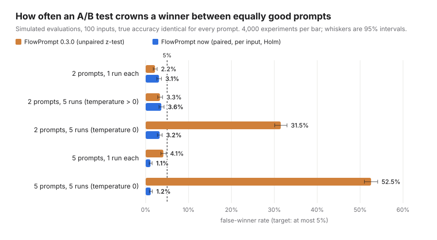
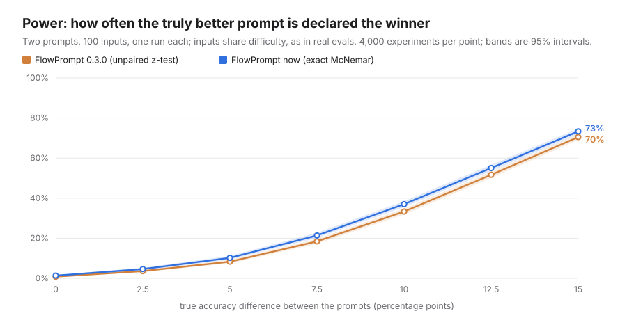

# Your prompt A/B test is probably lying to you: here's the math

You run two prompts over an eval set. One scores 74%, the other 69%. Your
tool says the difference is significant, so you ship the winner. How often is
that winner just noise?

It depends on the analysis more than most people expect. We simulated 240,000
prompt comparisons in which **every prompt was exactly as good as the others**,
then counted how often each analysis still named a winner. A sound method
should do that at most 5% of the time. The method FlowPrompt used up to
version 0.3.0 did it **52.5% of the time** in one common setup: five prompts,
five runs per input, temperature 0.

FlowPrompt's own `compare()` had these flaws up to and including 0.3.0, and
they are fixed now. This page explains what went wrong, what we do instead,
and how to check any tool, including ours.



## Three ways a prompt comparison goes wrong

### 1. Treating paired data as independent samples

In a prompt eval every variant answers the *same* inputs. That pairing is
the most useful information you have. Some inputs are hard for every prompt
and some are easy for every prompt, so the two variants' scores are strongly
correlated.

A two-proportion z-test compares 74% with 69% as if they came from two
unrelated groups of people. It ignores which inputs each prompt got right.
With positively correlated variants, this overestimates the noise in the
difference. In our simulation the unpaired test was conservative: 2.2% false
winners where 5% was allowed. It was also less powerful than the paired test
at every effect size we tried (see [power](#power-and-how-many-inputs-you-need)).

The paired alternative only looks at **discordant inputs**: those where one
prompt is right and the other is wrong. Inputs both prompts get right, or
both get wrong, say nothing about which prompt is better. Under the null
hypothesis each discordant input is a fair coin flip, so the number that
favour prompt B follows a Binomial(n_discordant, 1/2). That is the exact
McNemar test (McNemar, 1947).

Here is a worked example. Prompt A is right on 8 of 10 inputs and prompt B
on 4 of 10. On the 4 inputs where they disagree, A is always the one that is
right:

| | B right | B wrong |
|---|---:|---:|
| **A right** | 4 | 4 |
| **A wrong** | 0 | 2 |

The exact McNemar p-value is `2 x P(Binomial(4, 1/2) <= 0) = 2/16 = 0.125`.
The pooled z-test on 8/10 vs 4/10 reports p = 0.068 for the same data. Four
disagreements are not enough evidence, however different 80% and 40% look.

### 2. Counting repeated runs as more data

Running each input several times is a good way to see how much a prompt
varies from run to run. It does not give you more *inputs*. Ten inputs run
five times each is still ten inputs. If you pool the 50 runs into one success
rate and test it as if n = 50, every repeat shrinks the standard error even
though nothing new was learned.

At temperature 0 the damage is worst, because repeats are near-identical
copies. With 100 inputs and two equally good prompts:

| Runs per input | Old method (repeats counted as samples) | Paired, per input |
|---:|---:|---:|
| 3 | 19.1% (± 0.6) | 3.1% (± 0.3) |
| 5 | 31.5% (± 0.7) | 3.2% (± 0.3) |

At temperature > 0 the inflation is milder, because each repeat is genuinely
noisy. It still reaches 7.0% (± 0.4) with five prompts and five runs.

The fix is to use the input as the unit of analysis. Average each prompt's
runs per input, then run a paired test on the per-input differences.
FlowPrompt uses a sign-flip permutation test for this (exact when the
differences fall on a grid, which they do for pass/fail data). Its confidence
interval comes from a bootstrap that resamples whole inputs.

### 3. Comparing many prompts without correcting for it

With five prompts you make four comparisons against the baseline. Each one
has a 5% false-positive rate, so the chance that *at least one* comes out
"significant" is higher than 5%. Paired tests without a correction reached
up to 7.1% (± 0.4) false winners in our grid. Holm's step-down procedure
(Holm, 1979) controls the family-wise error rate under any dependence between
the comparisons, and it never rejects less than plain Bonferroni does. With
Holm, the five-prompt false-winner rate fell to 1.1% (± 0.2) at one run per
input.

### And a plain bug

FlowPrompt 0.3.0 chose the winner using the *relative* lift,
`(p_treatment - p_control) / p_control`. That lift is undefined when the
control scores 0, and the code returned 0 for it. As a result, a treatment
that was significantly better than a control scoring 0% was reported as a
win for the control. Winners are now decided by the sign of the absolute
difference. The relative lift is still reported, as `None` when it is
undefined.

## The results

We used the same data-generating model in every cell. Each input has a
latent difficulty drawn from Normal(0, 1.5) on the logit scale, shared by all
prompts. Each prompt adds its own item-level noise from Normal(0, 0.5). Mean
accuracy is about 67%, and two equal prompts disagree on about 33% of inputs.
Every cell has 4,000 simulated experiments, and the ± values are Monte Carlo
standard errors.

**False-winner rate with 100 inputs (target: at most 5%)**

| Scenario | FlowPrompt 0.3.0 | Paired, no correction | FlowPrompt now |
|---|---:|---:|---:|
| 2 prompts, 1 run | 2.2% (± 0.2) | 3.1% (± 0.3) | 3.1% (± 0.3) |
| 2 prompts, 5 runs, temperature > 0 | 3.3% (± 0.3) | 3.6% (± 0.3) | 3.6% (± 0.3) |
| 2 prompts, 5 runs, temperature 0 | 31.5% (± 0.7) | 3.2% (± 0.3) | 3.2% (± 0.3) |
| 5 prompts, 1 run | 4.1% (± 0.3) | 4.2% (± 0.3) | 1.1% (± 0.2) |
| 5 prompts, 5 runs, temperature > 0 | 7.0% (± 0.4) | 6.2% (± 0.4) | 1.5% (± 0.2) |
| 5 prompts, 5 runs, temperature 0 | 52.5% (± 0.8) | 5.5% (± 0.4) | 1.2% (± 0.2) |

The full grid covers 20, 50, 100 and 200 inputs, 2, 3 and 5 prompts, and 1,
3 and 5 runs, at both temperatures (60 cells). The old method's false-winner
rate reaches 53.1%. FlowPrompt's current method never exceeds 4.5% in any
cell (the largest upper 95% bound is 5.1%). The exact McNemar test is
conservative by design, so the rate sits below 5% rather than at it.

## Power, and how many inputs you need



With 100 inputs and a true 10-point accuracy difference, the paired test
names the better prompt 37.0% (± 0.8) of the time and the old unpaired test
33.3% (± 0.7). The paired test wins at every effect size, but the bigger
lesson is that **100 inputs are not enough to reliably detect a 10-point
difference.**

How many inputs you need depends on the difference you want to detect and on
the **discordance rate**: the fraction of inputs where the two prompts
disagree. Two prompts that fail on the same hard inputs disagree rarely, and
that makes a difference easier to detect. Connor's (1987) formula for paired
proportions turns this into a sample size. At this simulation's 33%
discordance, `plan_sample_size(0.10, discordance=0.33)` asks for about 257
inputs to reach 80% power. Assuming independent errors instead overstates the
requirement.

```python
from flowprompt import plan_sample_size

plan = plan_sample_size(0.10, discordance=0.33, n_variants=2)
print(plan)
# To detect a 10-point difference at 80% power you need ~257 inputs (~514 calls)
```

Don't know your discordance? Run a small pilot. `result.sample_size_plan(0.10)`
reuses the discordance and per-call cost observed in an earlier `compare()`.

## What to do

- **Use paired tests.** Every variant should see the same inputs, and the
  analysis should know it (McNemar for pass/fail, a paired test for scores).
- **Make the input the unit of analysis.** Repeats measure run-to-run
  variation; they do not add inputs.
- **Correct for multiple comparisons** when you compare more than two prompts
  (Holm).
- **Report the difference with a confidence interval**, not only a p-value.
  "+5 points (95% CI -3 to +13)" tells you what is at stake.
- **Plan the sample size before you run.** If you can only afford 50 inputs,
  know in advance which differences you can and cannot detect.
- **Don't stop at the first significant peek.** Re-testing after every batch
  inflates false positives. Fix the sample size in advance, or use a test
  built for continuous monitoring (FlowPrompt ships `SequentialMcNemar`, an
  always-valid test, for this).

In FlowPrompt this is the default:

```python
from flowprompt import compare

result = compare(
    {"baseline": Baseline, "concise": Concise, "few_shot": FewShot},
    inputs=[{"text": t} for t in texts],
    expected=labels,
    eval_metric="exact",
    runs_per_input=3,  # averaged per input, not counted as samples
    model="gpt-4o-mini",
)
print(result.verdict)  # one plain-English sentence
result.save_report("ab.html")  # or .md for a pull request
```

## Reproduce

The study runs offline, with no API keys, on a single CPU core:

```bash
uv run python benchmarks/false_winners.py         # about 6 minutes (356 s measured)
uv run python benchmarks/plot_false_winners.py    # redraws the charts in docs/assets/
uv run python benchmarks/false_winners.py --quick # about 10 seconds, 200 runs per cell
```

The script calls FlowPrompt's public functions (`run_significance_test` for
the 0.3.0 decision rule, and `paired_test`, `paired_sign_flip_test` and
`holm_adjust` for the current one). It also checks on 150 simulated
experiments that `compare()` reaches the same decision as the direct path
(150 of 150 agreed). Raw results are in `benchmarks/results/false_winners.json`
and `.csv`.

This is a simulation, and its absolute numbers depend on the assumed
difficulty spread and variant noise. The qualitative findings do not:
pseudo-replication inflates false positives, unpaired tests waste power on
correlated variants, and uncorrected multiple comparisons inflate the
family-wise error rate.

## References

- McNemar, Q. (1947). Note on the sampling error of the difference between
  correlated proportions or percentages. *Psychometrika*, 12(2), 153-157.
- Holm, S. (1979). A simple sequentially rejective multiple test procedure.
  *Scandinavian Journal of Statistics*, 6(2), 65-70.
- Connor, R. J. (1987). Sample size for testing differences in proportions
  for the paired-sample design. *Biometrics*, 43(1), 207-211.
- Agresti, A., & Min, Y. (2005). Simple improved confidence intervals for
  comparing matched proportions. *Statistics in Medicine*, 24(5), 729-740.
- Fagerland, M. W., Lydersen, S., & Laake, P. (2013). The McNemar test for
  binary matched-pairs data: mid-p and asymptotic are better than exact
  conditional. *BMC Medical Research Methodology*, 13, 91. FlowPrompt's
  `compare()` uses the exact conditional test, which is conservative;
  `mcnemar_exact(b, c, mid_p=True)` gives the mid-p version.
- Dror, R., Baumer, G., Shlomov, S., & Reichart, R. (2018). The Hitchhiker's
  Guide to Testing Statistical Significance in Natural Language Processing.
  *Proceedings of ACL 2018*.
- Miller, E. (2024). Adding Error Bars to Evals: A Statistical Approach to
  Language Model Evaluations. arXiv:2411.00640.
